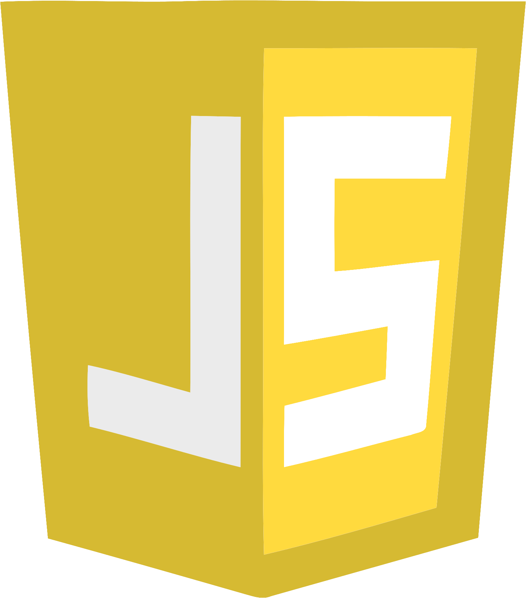
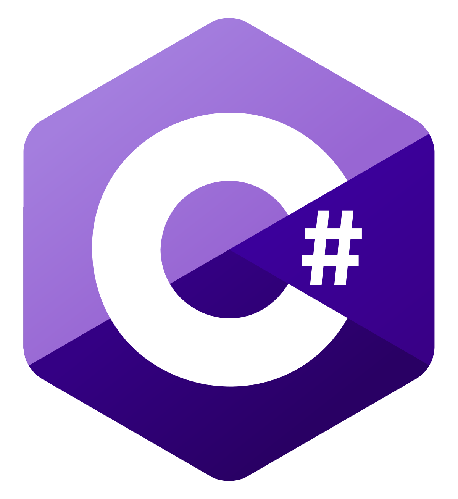

# JakeGuy11
Welcome to my GitHub page! I have 6 and a half years of coding experience with both software-only languages and hardware-interfacing languages.

## Skills

 

I've been using Java, Arduino (modified C++), and C#/.NET for the longest, and I'm most comfortable with C++, Java, Python, and Bash. I'm currently lead software on [FRC team 7722](https://www.thebluealliance.com/team/7722/2019) and was when we won the district event at Western University in our rookie year as well.\
I've been using Arch as a daily driver for quite some time, so I'm most experienced and comfortable writing command line applications for UNIX/Mac systems in Java, C++ and Python, although I'm also fairly experienced with the Java Swing graphics library.
## Hobbies/Interests
- I have a passion for math and physics, more specifically astrophysics. I hope to study mathematical physics at the University of Waterloo.
- I'm a woodworker and metalsmith/bladesmith. I'm still fairly inexperienced but I've produced several final pieces that I'm proud of.
- I'm a very big fan of the SciADV visual novel series (その目、だれの目？). I also enjoy watching anime and reading manga.
## Check out some of my projects:
- [youtube-archive](https://github.com/JakeGuy11/youtube-archive), a passive cli C++/python tool for archiving YouTube Livestreams
- [Image Sourcerer](https://github.com/JakeGuy11/image-sourcerer), a firefox addon that will download, tag and sort images from supported sites (not complete)
- [Silver Assistant (Windows Only)](https://github.com/JakeGuy11/silver-assistant-windows-only), a graphical C# tool for tracking the market price of silver (soon to be remade for UNIX systems).png
## Contact Me

 
\
If you have any questions or feedback about anything, contact me at any of the above (or email me at Jake_Guy_11@protonmail.ch).\
I'm also always open to coding commissions. If you have any questions about my capabilities or pricing, please email me!
## GitHub Statistics

