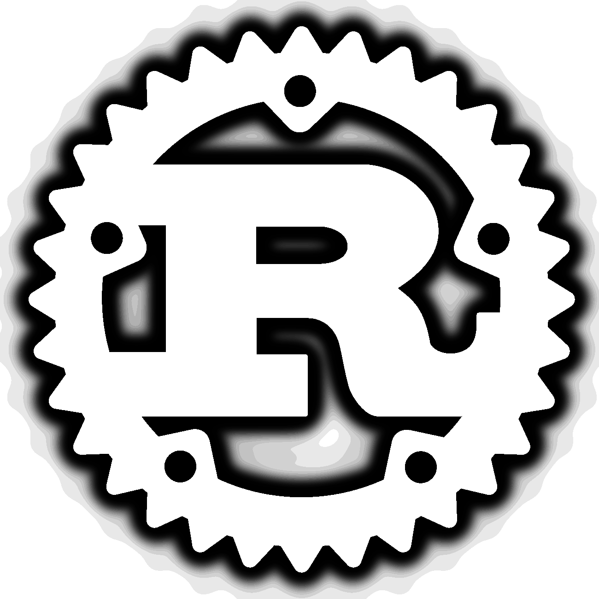

# JakeGuy11
Hello, welcome to my GitHub page! I have over 10 years of coding experience with a wide range of compiled and scripting languages. My focus isn't currently on software, as I am a student at the University of Waterloo for Materials and Nanosciences, although I will occasionally update projects.\

## Skills

 

I've been using Java, Python, and C#/.NET for the longest, and I'm most proficient with Linux sytems, Rust and Python. I'm a FIRST Robotics mentor for team [7722](https://www.thebluealliance.com/team/7722/), where I was the lead software on and was when we won the district event at Western University in our rookie year as well.\
I use Arch with DWM (Dynamic Window Manager) on my main computer, so I'm most experienced and comfortable writing command line applications for UNIX/Mac systems in Rust and C++.
## Hobbies/Interests
- I do archery competitively, and I'm a rangemaster at the University of Waterloo Archery Club
- I'm a woodworker and hobby blacksmith. I mostly design and create blades, tools and other hardware.
- I love learning languages; I'm in the process of learning German and Japanese
## Check out some of my projects:
- [Image Sourcerer](https://github.com/JakeGuy11/image-sourcerer) ([site](https://github.com/JakeGuy11/image-sourcerer-site) and [proxy](https://github.com/JakeGuy11/image-sourcerer-proxy) as well), a chrome addon that downloads, tags and sorts images from supported sites
- [rremind](https://github.com/JakeGuy11/rremind), a reminder program written in Rust
- [music-dl](https://github.com/JakeGuy11/music-dl), a cli rust tool for downloading and/or tagging music from youtube
- [youtube-archive](https://github.com/JakeGuy11/youtube-archive-cpp), a passive cli C++/python tool for archiving YouTube Livestreams
## Contact Me

 
\
If you have any questions or feedback about anything, contact me at any of the above socials (or email me at jmketko@uwaterloo.ca).\
I am also always open for tutoring or software commissions. If you have any questions about my capabilities or pricing, please email me!
